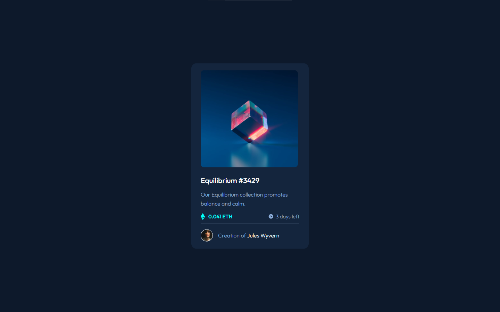

# Frontend Mentor - NFT preview card component solution

This is a solution to the [NFT preview card component challenge on Frontend Mentor](https://www.frontendmentor.io/challenges/nft-preview-card-component-SbdUL_w0U). Frontend Mentor challenges help you improve your coding skills by building realistic projects. 

## Table of contents

- [Overview](#overview)
  - [The challenge](#the-challenge)
  - [Screenshot](#screenshot)
  - [Links](#links)
- [My process](#my-process)
  - [Built with](#built-with)
  - [What I learned](#what-i-learned)
  - [Continued development](#continued-development)
  - [Useful resources](#useful-resources)
- [Author](#author)

**Note: Delete this note and update the table of contents based on what sections you keep.**

## Overview

### The challenge

Users should be able to:

- View the optimal layout depending on their device's screen size
- See hover states for interactive elements

### Screenshot

### Links

- Solution URL: [Add solution URL here](https://your-solution-url.com)
- Live Site URL: [Add live site URL here](https://jplawrence.github.io/nftpreviewcard/)

## My process

I started doing the mobile version first. I checked the style guides for the resources like font families and font sizes. I then basically just started the html markup keeping in mind the best practises. (That I'm aware of...) I then kept the design image in one tab and started styling the html to what I thought was closest to the design.

### Built with

- SASS 
- Semantic HTML5 markup
- CSS custom properties
- Flexbox
- Mobile-first workflow

### What I learned

While uploading the files I actually forgot about the hover interactions so I quickly deleted the repo and added those! What I learnt in that part was that you could actually trigger other elements based on hover! I had to do this for the display of the "eye" icon. So that was cool!

### Continued development

What I want to focus on a little more in these projects is accessibility rules and best practises. I also want to make reuseable, efficient code. 

### Useful resources

- [Hover](https://www.w3schools.com/csSref/sel_hover.asp) - This is where I learnt how to do that simple trigger thing for other elements!

## Author

- Frontend Mentor - [@yourusername](https://www.frontendmentor.io/profile/jplawrence)

